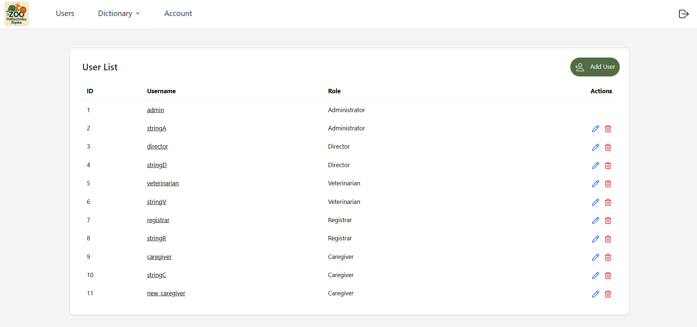
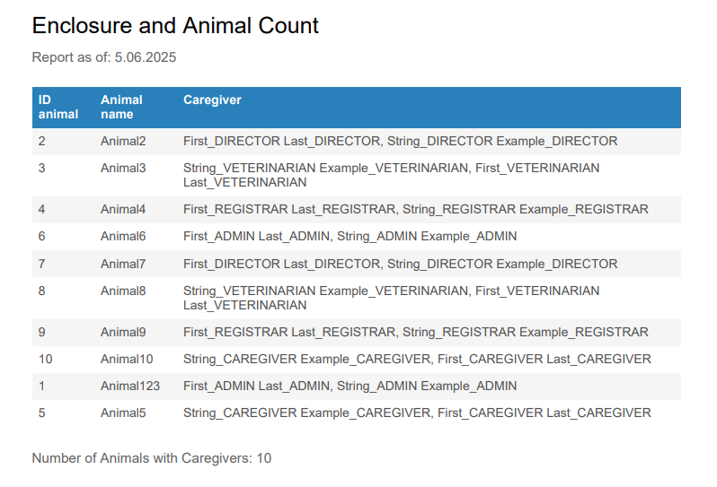
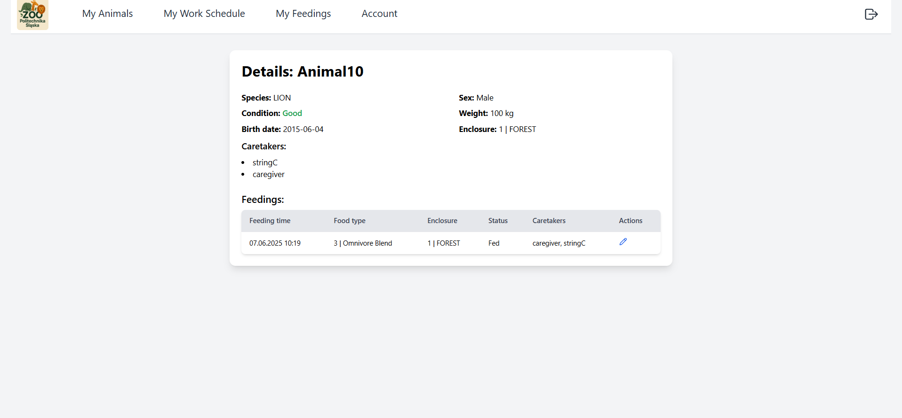

# Zoo Behavior Registration System

A comprehensive web-based system for managing zoo operations, including animal care, staff coordination, and behavior monitoring across a network of zoos.  
The system allows administrators to assign caregivers to animals, manage enclosures, schedule feedings, monitor animal health, and generate reports — all in one unified platform.

---

## 📋 Functional Requirements

### 🐾 Animal Management
- Add a new animal (species, age, enclosure, etc.)
- Update animal data
- Assign animals to enclosures
- Manage health cards
- Manage feeding schedules and food types

### 🧑‍💼 Employee Management
- Add/update/delete employee
- Assign roles (e.g., veterinarian, caregiver)
- Edit roles
- Assign feeding schedules

### 🏞️ Enclosure Management
- Create, update, or delete enclosures
- Add terrain type and other descriptive information

### 📊 Reporting System
- Display animals with assigned caregivers
- List of sick animals
- Show animals assigned to a given caregiver
- Show caregivers assigned to specific animals

### 📚 Dictionary Data Management
- Add animal species
- Add types of food

---

## 🔐 Role Hierarchy

### **Director**
- Manages the organization
- Makes strategic decisions
- Views reports (e.g., list of employees, enclosures, sick animals)
- Partially overlaps with Registrar and Veterinarian responsibilities

### **Admin**
- Manages system data and users
- Creates dictionary entries (species, food)
- Manages user roles and permissions
- Shares some responsibilities with Registrar and Director

### **Registrar**
- Enters and manages animal, caregiver, and enclosure data
- Assigns species, birth dates, food types, and terrain types

### **Caregiver**
- Provides daily care for assigned animals
- Updates data (feeding time, food, enclosure)
- Reports sick animals

### **Veterinarian**
- Oversees animal health
- Views sick animal reports
- Records treatment information

---

## 🛠️ Technologies Used

- **React** (Frontend)
- **Java Spring Boot** (Backend - Web, Data JPA, Security)
- **PostgreSQL** (Database)
- **Docker** (Containerization)

---

## 💻 System Requirements

- Docker installed and configured on your machine.

---

## 🚀 How to Run the Project

1. Open a terminal in the root directory of the project (where the `docker-compose.yml` file is located).
2. Run the following command:

```bash
docker-compose up --build -d
````

This will build and start 3 containers:

* **Database**
* **Backend**
* **Frontend**

### 🔗 Access the Application locally

* **Login Page**: [http://localhost:3000/login](http://localhost:3000/login)
* **API Documentation (Swagger)**: [http://localhost:8083/swagger-ui/index.html](http://localhost:8083/swagger-ui/index.html)

### 🌐 Temporary Azure Deployment

* **Frontend**: [https://tab-zoo-frontend-aef5ctfnfpfrd5hu.polandcentral-01.azurewebsites.net/login](https://tab-zoo-frontend-aef5ctfnfpfrd5hu.polandcentral-01.azurewebsites.net/login)
* **Swagger Docs**: [https://tab-zoo-backend.nicemeadow-5d15288c.polandcentral.azurecontainerapps.io/swagger-ui/index.html#](https://tab-zoo-backend.nicemeadow-5d15288c.polandcentral.azurecontainerapps.io/swagger-ui/index.html#)

### 🧪 Test Accounts

Available test accounts (passwords are the same as usernames):

* `admin`
* `director`
* `veterinarian`
* `registrar`
* `caregiver`

---

## 🖼️ Some screenshots

### 👤 Users Panel


### 📋 Report Card


### 🐾 Animal Details


---

## 📄 License

This project is for educational purposes only.

---

## 👥 Contributors

* Emanuel Jureczko
* Julia Żółty
* Adrianna Żółtowska
* Mateusz Budziak
* Dawid Kąkol
* Bartłomiej Misiarz


